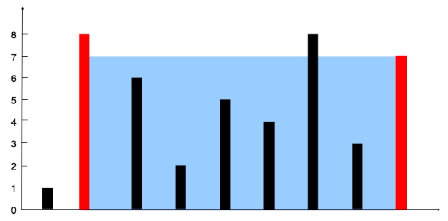

# [盛最多水的容器](https://leetcode-cn.com/problems/container-with-most-water/)

## 描述  
**中等**  

给定 n 个非负整数 a1，a2，...，an，每个数代表坐标中的一个点 (i, ai) 。在坐标内画 n 条垂直线，垂直线 i 的两个端点分别为 (i, ai) 和 (i, 0)。找出其中的两条线，使得它们与 x 轴共同构成的容器可以容纳最多的水。  

你不能倾斜容器，且 n 的值至少为 2。

<div align="left"></div>

图中垂直线代表输入数组 [1,8,6,2,5,4,8,3,7]。在此情况下，容器能够容纳水（表示为蓝色部分）的最大值为 49。

**示例：** 

    输入: [1,8,6,2,5,4,8,3,7]
    输出: 49

## 解题  
使用双指针  

能接的雨水量等于右指针减去左指针的值（底）乘以左右指针中对应的两个高中较小的那个高（高）


**如果左指针对应的高比右指针对应的高要小**，则左指针向右移动才有可能获得更多的水

如果右指针左移，首先底肯定是变小了，高可能仍然是左指针对应的高，也有可能变小

> 木桶原理是讲一只水桶能装多少水取决于它最短的那块木板
>
> 不过木桶原理好像存在一些争议，哈哈

```python
class Solution:
    def maxArea(self, height: List[int]) -> int:
        left, right = 0, len(height) - 1
        max_value = 0
        while left < right:
            value = (right - left) * min(height[left], height[right])
            max_value = max(max_value, value)
            if height[left] < height[right]:
                left += 1
            else:
                right -= 1
        return max_value
```
