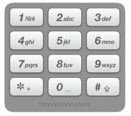

# [电话号码的字母组合](https://leetcode-cn.com/problems/letter-combinations-of-a-phone-number/)

## 描述  
**中等**  

给定一个仅包含数字 2-9 的字符串，返回所有它能表示的字母组合。

给出数字到字母的映射如下（与电话按键相同）。注意 1 不对应任何字母。

<div align="left"></div>

**示例**

    输入："23"
    输出：["ad", "ae", "af", "bd", "be", "bf", "cd", "ce", "cf"].

## 解题  
多层循环暴力求解

```python
class Solution:
    def letterCombinations(self, digits: str) -> List[str]:
        key = {
            '2': ['a', 'b', 'c'],
            '3': ['d', 'e', 'f'],
            '4': ['g', 'h', 'i'],
            '5': ['j', 'k', 'l'],
            '6': ['m', 'n', 'o'],
            '7': ['p', 'q', 'r', 's'],
            '8': ['t', 'u', 'v'],
            '9': ['w', 'x', 'y', 'z']
        }

        if digits == '':
            return []
        ans = ['']
        for num in digits:
            ans = [pre+suf for pre in ans for suf in key[num]]
        return ans

```

回溯  

```python
class Solution:
    def letterCombinations(self, digits: str) -> List[str]:
        key = {
            '2': ['a', 'b', 'c'],
            '3': ['d', 'e', 'f'],
            '4': ['g', 'h', 'i'],
            '5': ['j', 'k', 'l'],
            '6': ['m', 'n', 'o'],
            '7': ['p', 'q', 'r', 's'],
            '8': ['t', 'u', 'v'],
            '9': ['w', 'x', 'y', 'z']
        }

        if digits == '':
            return []
        ans = []

        def backtrack(n, tmp):
            if n==len(digits):
                ans.append(tmp)
                return 
            
            for i in range(len(key[digits[n]])):
                backtrack(n+1, tmp+key[digits[n]][i])
        
        backtrack(0, '')
        return ans

```