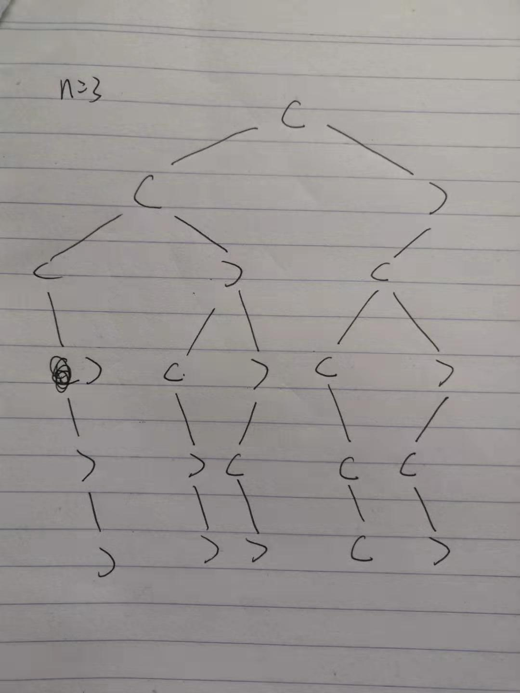

# [括号生成](https://leetcode-cn.com/problems/generate-parentheses/)

## 描述  
**中等**  

给出 n 代表生成括号的对数，请你写出一个函数，使其能够生成所有可能的并且有效的括号组合。

**示例** 

    给出 n = 3，生成结果为：
    
    [
        "((()))",
        "(()())",
        "(())()",
        "()(())",
        "()()()"
    ]

## 解题  

**递归暴力循环**  

考虑i=n时相比n-1时增加的一对括号的位置  

增加一对括号，首先是最左边增加'('，然后考虑')'加在哪个位置  

遍历  

`(` + `i=p时的括号组合`+ `)` + `i=q时的括号组合`

p + q = n-1


```python 
class Solution:
    def generateParenthesis(self, n: int) -> List[str]:
        if n == 0:
            return [""]
        elif n == 1:
            return ["()"]
        elif n == 2:
            return ["()()", "(())"]
        result = []
        for i in range(n):
            j = n - 1 - i
            temp1 = self.generateParenthesis(i)
            temp2 = self.generateParenthesis(j)
            result.extend(["(%s)%s" % (p, q) for p in temp1 for q in temp2])
        return result

```

**DFS**  

建立有效的树，再使用深度遍历的思想，添加有效的序列     

left和right为左括号和右括号还可以使用的个数（建树的方向）   

当left和right为零时，建成了一条路，为有效的序列  

<div align="left"></div>

```python  
class Solution:
    def generateParenthesis(self, n: int) -> List[str]:
        res = []
        cur_str = ''
        def dfs(cur_str, left, right):
            if left == 0 and right == 0: # 左括号和右括号已用完，为一个解
                res.append(cur_str)
                return 
            if right<left:
                return 
            if left > 0:
                dfs(cur_str+'(', left-1, right)
            if right > 0:
                dfs(cur_str+')', left, right-1)
        
        dfs(cur_str, n, n)

        return res
```