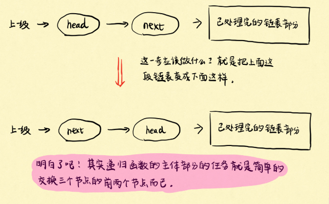

# [两两交换链表中的节点](https://leetcode-cn.com/problems/swap-nodes-in-pairs/)

## 描述  
**中等**  

给定一个链表，两两交换其中相邻的节点，并返回交换后的链表。

你不能只是单纯的改变节点内部的值，而是需要实际的进行节点交换。

**示例**  

    给定 1->2->3->4, 你应该返回 2->1->4->3.

## 解题  

**递归**     

图片来自[网上大佬](https://lyl0724.github.io/2020/01/25/1/)

<div align="left"></div>

```python
# Definition for singly-linked list.
# class ListNode:
#     def __init__(self, x):
#         self.val = x
#         self.next = None

class Solution:
    def swapPairs(self, head: ListNode) -> ListNode:
        if head == None or head.next == None:
            return head
        
        p = head.next
        head.next = self.swapPairs(p.next)
        p.next = head

        return p
```
**普通指针**  

设立三个指针，分别指向前后节点和当前节点，两两交换后，移动步长为2

```python
# Definition for singly-linked list.
# class ListNode:
#     def __init__(self, x):
#         self.val = x
#         self.next = None

class Solution:
    def swapPairs(self, head: ListNode) -> ListNode:
        dummy = ListNode(-1)    # 添加空头指针
        dummy.next = head
        c = dummy
        while c.next and c.next.next:
            a, b = c.next, c.next.next
            c.next, a.next = b, b.next
            b.next = a
            c = c.next.next
        
        return dummy.next
```