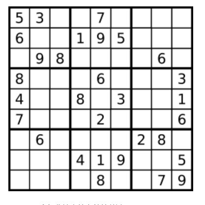

# [有效的数独](https://leetcode-cn.com/problems/valid-sudoku/)

## 描述  
**中等** 

判断一个 9x9 的数独是否有效。只需要根据以下规则，验证已经填入的数字是否有效即可。

- 数字 1-9 在每一行只能出现一次。

- 数字 1-9 在每一列只能出现一次。

- 数字 1-9 在每一个以粗实线分隔的 3x3 宫内只能出现一次。

<div align="left"></div>

上图是一个部分填充的有效的数独。

数独部分空格内已填入了数字，空白格用 '.' 表示。

**示例**

    输入:
    [
        ["5","3",".",".","7",".",".",".","."],
        ["6",".",".","1","9","5",".",".","."],
        [".","9","8",".",".",".",".","6","."],
        ["8",".",".",".","6",".",".",".","3"],
        ["4",".",".","8",".","3",".",".","1"],
        ["7",".",".",".","2",".",".",".","6"],
        [".","6",".",".",".",".","2","8","."],
        [".",".",".","4","1","9",".",".","5"],
        [".",".",".",".","8",".",".","7","9"]
    ]
    输出: true


    输入:
    [
        ["8","3",".",".","7",".",".",".","."],
        ["6",".",".","1","9","5",".",".","."],
        [".","9","8",".",".",".",".","6","."],
        ["8",".",".",".","6",".",".",".","3"],
        ["4",".",".","8",".","3",".",".","1"],
        ["7",".",".",".","2",".",".",".","6"],
        [".","6",".",".",".",".","2","8","."],
        [".",".",".","4","1","9",".",".","5"],
        [".",".",".",".","8",".",".","7","9"]
    ]
    输出: false
    解释: 除了第一行的第一个数字从 5 改为 8 以外，空格内其他数字均与 示例1 相同。
        但由于位于左上角的 3x3 宫内有两个 8 存在, 因此这个数独是无效的。

**说明:**

一个有效的数独（部分已被填充）不一定是可解的。  

只需要根据以上规则，验证已经填入的数字是否有效即可。  

给定数独序列只包含数字 1-9 和字符 '.' 。  

给定数独永远是 9x9 形式的。


## 解题  
主要还是按照上面的3个规则来判断是否有效  

rows 保存每行的数字  

columns 保存每列的数字  

boxes 保存9个九宫格的数字  

来判断是否有重复  

python的字典是通过哈希散列保存的，查找速度快

```python
class Solution:
    def isValidSudoku(self, board: List[List[str]]) -> bool:
        rows = [{} for i in range(9)]
        columns = [{} for i in range(9)]
        boxes = [{} for i in range(9)]

        for i in range(9):
            for j in range(9):
                num = board[i][j]
                if num != '.':
                    num = int(num)
                    box_index = (i // 3) * 3 + j // 3 # 九宫格编号

                    rows[i][num] = rows[i].get(num, 0) + 1
                    columns[j][num] = columns[j].get(num, 0) + 1
                    boxes[box_index][num] = boxes[box_index].get(num, 0) + 1

                    # 判断区域内是否出现多次
                    if rows[i][num] > 1 or columns[j][num] > 1 or boxes[box_index][num] > 1:
                        return False
        
        return True
```

