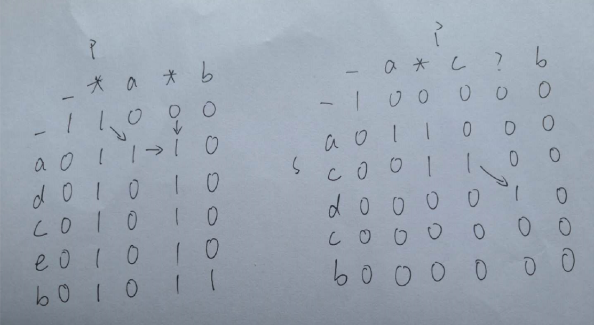

# [通配符匹配](https://leetcode-cn.com/problems/wildcard-matching/)

## 描述  
**困难**  

给定一个字符串 (s) 和一个字符模式 (p) ，实现一个支持 '?' 和 '*' 的通配符匹配。

'?' 可以匹配任何单个字符。
'*' 可以匹配任意字符串（包括空字符串）。
两个字符串完全匹配才算匹配成功。

说明:

s 可能为空，且只包含从 a-z 的小写字母。
p 可能为空，且只包含从 a-z 的小写字母，以及字符 ? 和 *。

**示例** 

    输入:
    s = "aa"
    p = "a"
    输出: false
    解释: "a" 无法匹配 "aa" 整个字符串。
    
    输入:
    s = "aa"
    p = "*"
    输出: true
    解释: '*' 可以匹配任意字符串。
    
    输入:
    s = "cb"
    p = "?a"
    输出: false
    解释: '?' 可以匹配 'c', 但第二个 'a' 无法匹配 'b'。
    
    输入:
    s = "adceb"
    p = "*a*b"
    输出: true
    解释: 第一个 '*' 可以匹配空字符串, 第二个 '*' 可以匹配字符串 "dce".
    
    输入:
    s = "acdcb"
    p = "a*c?b"
    输入: false

## 解题  
和[第10题](https://leetcode-cn.com/problems/regular-expression-matching/)类似，当然也想一个正则结束战斗。   

不过，还是动态规划  

如果当前p为*，取决于上边和左边    

如果当前p为？或与当前s相同，取决于左上  

其他为False

<div align="left"></div>


```python
class Solution:
    def isMatch(self, s: str, p: str) -> bool:
        m = len(s)
        n = len(p)
        dp = [[False]*(n+1) for _ in range(m+1)]
        dp[0][0] = True
        for i in range(1, n+1):
            if p[i-1] == '*':
                dp[0][i] = True
            else:
                break

        for i in range(1, m+1):
            for j in range(1, n+1):
                if p[j-1] == '*':
                    dp[i][j] = dp[i][j-1] or dp[i-1][j]
                elif p[j-1]=='?' or s[i-1]==p[j-1]:
                    dp[i][j] = dp[i-1][j-1]
                else:
                    dp[i][j] == False
        
        return dp[m][n]

```
