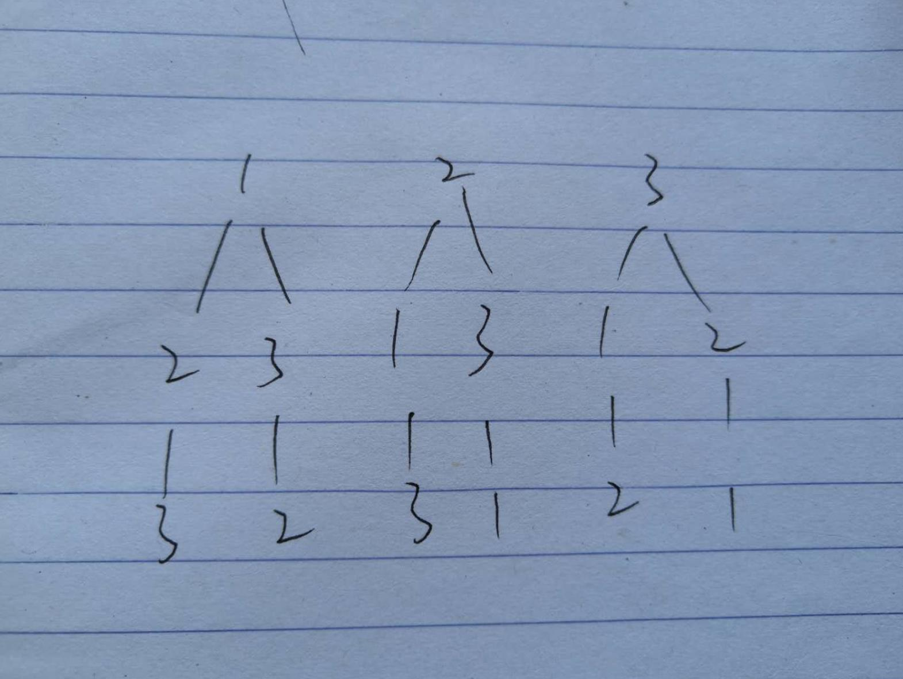

# [全排列](https://leetcode-cn.com/problems/permutations/)

## 描述  
**中等**  

给定一个没有重复数字的序列，返回其所有可能的全排列。

**示例：**

    输入: [1,2,3]
    输出:
    [
        [1,2,3],
        [1,3,2],
        [2,1,3],
        [2,3,1],
        [3,1,2],
        [3,2,1]
    ]

## 解题  
貌似有全排列的库函数  
```python
class Solution:
    def permute(self, nums: List[int]) -> List[List[int]]:
        return list(itertools.permutations(nums))
```
<div align="left"></div>  

可以直接看代码，将去除当前数字的列表放到下一层的dfs中  

直到该列表为空

```python
from typing import List


class Solution:
    def permute(self, nums: List[int]) -> List[List[int]]:
        res = []

        def dfs(nums, temp):
            if not nums:
                res.append(temp)
                return
            for i in range(len(nums)):
                # 将去除当前数字的列表送入下一层
                dfs(nums[:i] + nums[i + 1:], temp + [nums[i]])

        dfs(nums, [])
        return res


if __name__ == '__main__':
    nums = [1, 2, 3]
    print(Solution().permute(nums))
```

# [全排列II](https://leetcode-cn.com/problems/permutations-ii/)

## 描述  

**中等** 
给定一个可包含重复数字的序列，返回所有不重复的全排列。

**示例：**

    输入: [1,1,2]
    输出:
    [
        [1,1,2],
        [1,2,1],
        [2,1,1]
    ]

## 解题  

在46题的基础上添加去重的语句，并事先需要将数字排序，以便在回溯中去重  

```python
from typing import List


class Solution:
    def permuteUnique(self, nums: List[int]) -> List[List[int]]:
        nums.sort()
        res = []

        def dfs(nums, temp):
            if not nums:
                res.append(temp)
                return
            for i in range(len(nums)):
                if i > 0 and nums[i] == nums[i - 1]:
                    continue
                dfs(nums[:i] + nums[i + 1:], temp + [nums[i]])

        dfs(nums, [])
        return res


if __name__ == '__main__':
    nums = [1, 1, 2]
    print(Solution().permuteUnique(nums))
```