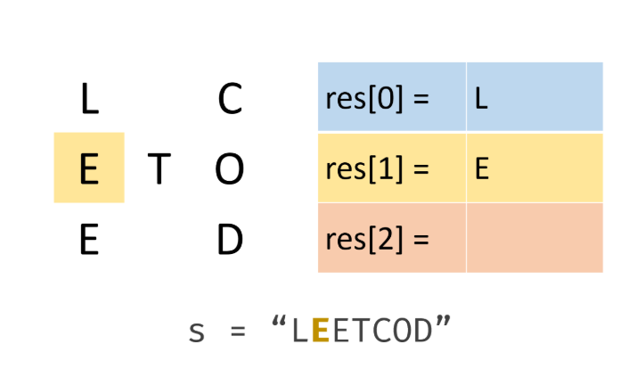
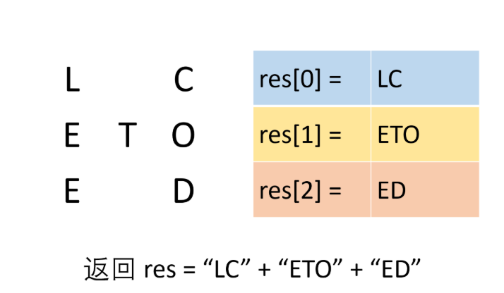

# [Z字形变换](https://leetcode-cn.com/problems/zigzag-conversion/ )

## 描述
**中等**  

将一个给定字符串根据给定的行数，以从上往下、从左到右进行 Z 字形排列。

比如输入字符串为 "LEETCODEISHIRING" 行数为 3 时，排列如下：

    L   C   I   R
    E T O E S I I G
    E   D   H   N

之后，你的输出需要从左往右逐行读取，产生出一个新的字符串，比如："LCIRETOESIIGEDHN"。

**示例：**

    输入: s = "LEETCODEISHIRING", numRows = 3
    输出: "LCIRETOESIIGEDHN"
    
    输入: s = "LEETCODEISHIRING", numRows = 4
    输出: "LDREOEIIECIHNTSG"
    解释:
    
    L     D     R
    E   O E   I I
    E C   I H   N
    T     S     G

## 解题    

设立`numRows`个不同的行来储存不同的字母，并用`flag`控制一个个存储的方向，具体看代码
<div align="left"> </div>

<div align="left"></div>


```python
class Solution:
    def convert(self, s: str, numRows: int) -> str:
        if numRows < 2:
            return s
        res = ['' for _ in range(numRows)]
        i = 0	# 当前需要添加字符的行
        flag = -1	# 控制行的向上向下变化
        for c in s:
            res[i] += c
            # 如果当前是第一行或最后一行，flag取反
            # 表示存储字符的方向的改变
            if i == 0 or i == numRows - 1:
                flag = -flag
            i += flag 	# 通过加上flag来改变当前需要添加字符的行

        return ''.join(res)
```
