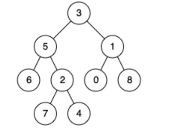

# [二叉树的最近公共祖先](https://leetcode-cn.com/problems/lowest-common-ancestor-of-a-binary-tree/)  
## 描述  
**中等**  

给定一个二叉树, 找到该树中两个指定节点的最近公共祖先。

[百度百科](https://baike.baidu.com/item/%E6%9C%80%E8%BF%91%E5%85%AC%E5%85%B1%E7%A5%96%E5%85%88/8918834?fr=aladdin)中最近公共祖先的定义为：“对于有根树 T 的两个结点 p、q，最近公共祖先表示为一个结点 x，满足 x 是 p、q 的祖先且 x 的深度尽可能大（一个节点也可以是它自己的祖先）。”

例如，给定如下二叉树:  root = [3,5,1,6,2,0,8,null,null,7,4]

<div></div>


**示例 1:**

    输入: root = [3,5,1,6,2,0,8,null,null,7,4], p = 5, q = 1
    输出: 3
    解释: 节点 5 和节点 1 的最近公共祖先是节点 3。
**示例 2:**

    输入: root = [3,5,1,6,2,0,8,null,null,7,4], p = 5, q = 4
    输出: 5
    解释: 节点 5 和节点 4 的最近公共祖先是节点 5。因为根据定义最近公共祖先节点可以为节点本身。


**说明:**

所有节点的值都是唯一的。
p、q 为不同节点且均存在于给定的二叉树中。

## 解题  

如果根节点为p或q，直接返回根节点  

否则对左右子树进行查找   

- 如果返回左右子树返回值都存在，说明p和q存在于左右子树中，则当前节点即为最近的公共祖先节点
- 如果只有一个存在，说明p和q存在于左或者右子树中
- 如果都不存在，说明p和q不存在于树中

如果p和q为6和4  

递归到6时，直接向上返回6  

递归到2时，其左值返回None，右值返回4，则向上返回4  

则5的左值和右值同时存在，向上返回5    

3的左值为5，右值为None，则最后返回5    


```python
# Definition for a binary tree node.
# class TreeNode:
#     def __init__(self, x):
#         self.val = x
#         self.left = None
#         self.right = None

class Solution:
    def lowestCommonAncestor(self, root: 'TreeNode', p: 'TreeNode', q: 'TreeNode') -> 'TreeNode':
        if not root:
            return None
        
        if root == p or root == q:
            return root
        
        left = self.lowestCommonAncestor(root.left, p, q)
        right = self.lowestCommonAncestor(root.right, p, q)

        if left and right:
            return root
        elif left:
            return left
        elif right:
            return right

        return None
```

