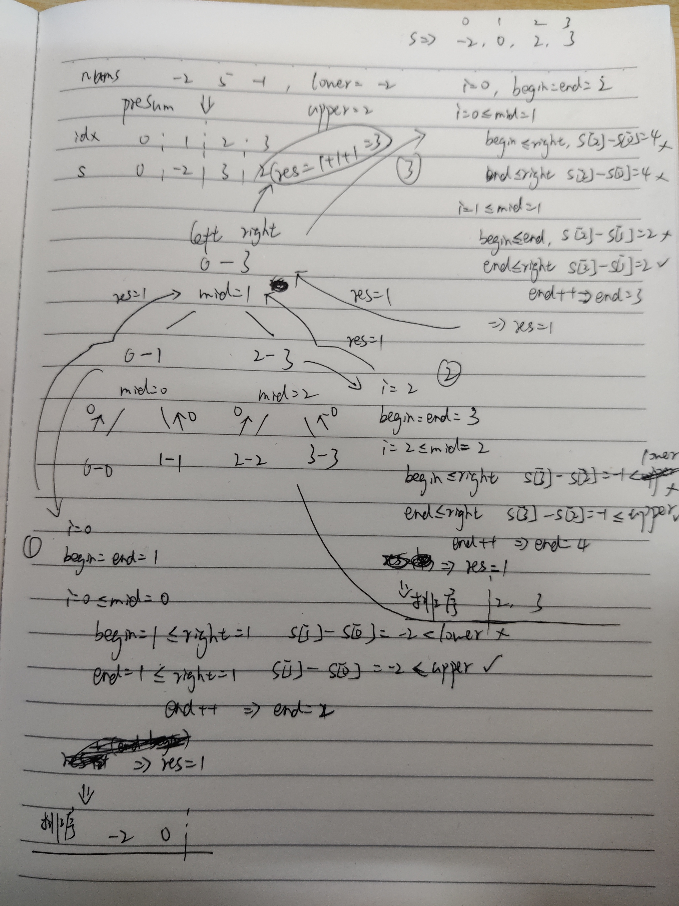

# [区间和的个数](https://leetcode-cn.com/problems/count-of-range-sum/)

## 描述

**困难**

给定一个整数数组 `nums`，返回区间和在 `[lower, upper]` 之间的个数，包含 `lower` 和 `upper`。
区间和 `S(i, j)` 表示在 `nums` 中，位置从 `i` 到 `j` 的元素之和，包含 `i` 和 `j (i ≤ j)`。

**说明:**
最直观的算法复杂度是 `O(n^2)` ，请在此基础上优化你的算法。

**示例:**

```
输入: nums = [-2,5,-1], lower = -2, upper = 2,
输出: 3 
解释: 3个区间分别是: [0,0], [2,2], [0,2]，它们表示的和分别为: -2, -1, 2。
```

## 解题

题目是要找一个区间，这个区间中的数据的和在lower和upper之间

这个区间可以只包含一个数

求一共有多少个这样的区间

先按**暴力**来一下最简单的解法

不过超时了

```python
class Solution:
    def countRangeSum(self, nums: List[int], lower: int, upper: int) -> int:
        n = len(nums)
        res = 0
        for i in range(n):
            s = 0
            for j in range(i, n):
                s += nums[j]
                if lower <= s <= upper:
                    res += 1

        return res

```

不过使用java还是可以通过所有用例的

不过有一点，其中`sum`的类型需要为`long`，如果是`int`，也是通不过的，算是一个坑

```java
class Solution {
    public int countRangeSum(int[] nums, int lower, int upper) {
        int res = 0;
        for (int i = 0; i < nums.length; i++) {
            long sum = 0;
            for (int j = i; j < nums.length; j++) {
                sum += nums[j];
                if (lower <= sum && sum <= upper) res++;
            }
        }
        return res;
    }
}
```

**归并排序**

首先求出前缀和，即前`n`个数之和的序列，长度为原`nums`数组加一

`pre_sum = [0, num[0], num[0]+num[1], num[0]+nums[1]+num[2],...]`

学习[官方题解](https://leetcode-cn.com/problems/count-of-range-sum/solution/qu-jian-he-de-ge-shu-by-leetcode-solution/)，问题可以等价为求有效的下标对`(i, j)`

其下标对`(i, j)`区间的和为`pre_sum[j] - pre_sum[i]`（具体边界问题需要考虑下）

满足条件`lower <= pre_sum[j] - pre_sum[i] <= upper`时，`(i, j)`为有效下标对

所以，当前缀和数组为**升序**时

令`i`，`j_begin`，`j_end`初始值相同

- 将`j_begin`指针向右滑动，`pre_sum[j_begin]`越来越大

  直到`pre_sum[j_begin] - pre_sum[i] >= lower`

- 然后，将`j_end`指针向右滑动

  直到`pre_sum[j_end] - pre_sum[i] > upper`

- 记录区间`[j_begin, j_end)`的大小，即为有效的下标对数
- 向右移动`i`，对应`pre_sum[i]`变大，新的`j`区间也有两种情况
  - `j_begin`需要右移或不变
  - `j_end` 需要右移或不变
  - 所以无需重置`j_begin`和`j_end`


**归并排序**将数组分成**排好序**的左右两部分，`i`在左，`j`在右（`j_begin`, `j_end`都在右部分）

固定`i`，来找所有`j`的可能，找完后移动`i`，再找`j`

将官方代码翻译成了python，就是效率有点低

```python
from typing import List


class Solution:
    def countRangeSum(self, nums: List[int], lower: int, upper: int) -> int:
        n = len(nums)
        pre_sum = [0 for _ in range(n + 1)]
        for i in range(n):
            pre_sum[i + 1] = nums[i] + pre_sum[i]

        return self.merge(pre_sum, lower, upper, 0, n)

    def merge(self, pre_sum, lower, upper, left, right):
        if left == right:
            return 0
        mid = (left + right) // 2
        n1 = self.merge(pre_sum, lower, upper, left, mid)
        n2 = self.merge(pre_sum, lower, upper, mid + 1, right)
        res = n1 + n2

        i = left
        j_begin = mid + 1
        j_end = mid + 1
        while i <= mid:
            while j_begin <= right and pre_sum[j_begin] - pre_sum[i] < lower: j_begin += 1
            while j_end <= right and pre_sum[j_end] - pre_sum[i] <= upper: j_end += 1
            res += j_end - j_begin
            i += 1

        sort = [0 for i in range(right - left + 1)]
        p1 = left
        p2 = mid + 1
        p = 0
        while p1 <= mid or p2 <= right:
            if p1 > mid:
                sort[p] = pre_sum[p2]
                p2 += 1
            elif p2 > right:
                sort[p] = pre_sum[p1]
                p1 += 1
            else:
                if pre_sum[p1] < pre_sum[p2]:
                    sort[p] = pre_sum[p1]
                    p1 += 1
                else:
                    sort[p] = pre_sum[p2]
                    p2 += 1
            p += 1

        for j in range(len(sort)):
            pre_sum[left + j] = sort[j]

        return res

```

那么问题来了

为什么通过排序后的有效对数是不变的，为什么可以用归并排序

笨方法，按照示例手动推算了一遍

```
输入: nums = [-2,5,-1], lower = -2, upper = 2,
输出: 3 
解释: 3个区间分别是: [0,0], [2,2], [0,2]，它们表示的和分别为: -2, -1, 2。
```

其前缀和数组为`[0,-2,3,2]`

<div align="left"> </div>


有点乱

左右两边的数据只是顺序变了，其数值没有变

左边每个数和右边的每个数进行比较，其比较的先后顺序并不影响结果

题目只是求区间的数量，与数据位置无关