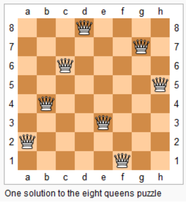

# [N皇后](https://leetcode-cn.com/problems/n-queens/)

## 描述  
**困难**  

n 皇后问题研究的是如何将 n 个皇后放置在 n×n 的棋盘上，并且使皇后彼此之间不能相互攻击。

<div align="left"></div>

上图为 8 皇后问题的一种解法。

给定一个整数 n，返回所有不同的 n 皇后问题的解决方案。

每一种解法包含一个明确的 n 皇后问题的棋子放置方案，该方案中 'Q' 和 '.' 分别代表了皇后和空位。

**示例**

    输入: 4
    输出: 
    [
        [".Q..",  // 解法 1
        "...Q",
        "Q...",
        "..Q."],
    
        ["..Q.",  // 解法 2
        "Q...",
        "...Q",
        ".Q.."]
    ]
    解释: 4 皇后问题存在两个不同的解法。

## 解题  
好经典   

回溯     

row到了n行，说明已经摆放完毕，添加至解集

```python
class Solution:
    def solveNQueens(self, n: int) -> List[List[str]]:
        res = []
        board = [['.']*n for _ in range(n)]

        # 判断该位置上，是否于其他皇后冲突
        def is_valid(board, row, col):
            # 检查列上是否冲突
            for i in range(row):
                if board[i][col] == 'Q':
                    return False
            # 检查左上是否冲突
            row_l = row
            col_l = col
            while row_l > 0 and col_l > 0:
                row_l -= 1
                col_l -= 1
                if board[row_l][col_l] == 'Q':
                    return False
             # 检查右上是否冲突
            row_r = row
            col_r = col
            while row_r > 0 and col_r < n-1:
                row_r -= 1
                col_r += 1
                if board[row_r][col_r] == 'Q':
                    return False
            
            return True
            
        def backtrack(board, row):
            # 排列完毕
            if row == n:
                temp = list(map(lambda x: ''.join(x), board))
                res.append(temp)
                return 

            for col in range(n):
                if not is_valid(board, row, col):
                    continue
                # 选择一个位置作为皇后
                board[row][col] = 'Q'
                # 放置下一行的皇后
                backtrack(board, row+1)
                # 取消选择
                board[row][col] = '.'
        
        backtrack(board, 0)
        return res
            
        

```
# [N皇后II](https://leetcode-cn.com/problems/n-queens-ii)  

返回不同解决方案的数量  

和51类似，返回len(res)就行了  