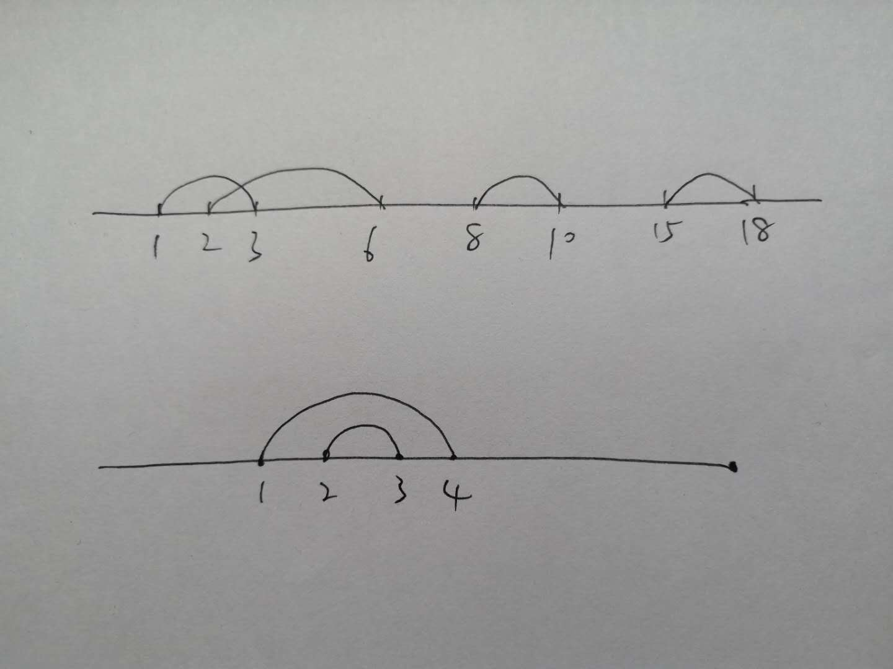
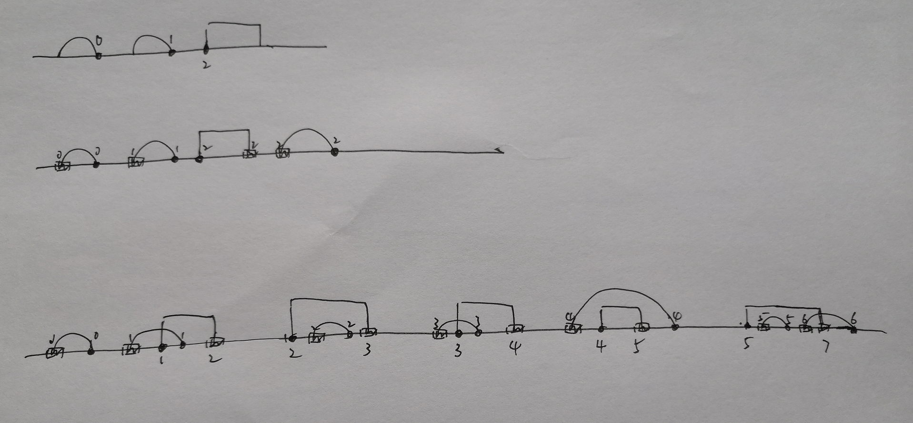

# [合并区间](https://leetcode-cn.com/problems/merge-intervals/)

## 描述  
**中等**   

给出一个区间的集合，请合并所有重叠的区间。

**实例1：**

    输入: [[1,3],[2,6],[8,10],[15,18]]
    输出: [[1,6],[8,10],[15,18]]
    解释: 区间 [1,3] 和 [2,6] 重叠, 将它们合并为 [1,6].


**实例2：**

```
输入: [[1,4],[4,5]]
输出: [[1,5]]
解释: 区间 [1,4] 和 [4,5] 可被视为重叠区间
```

## 解题  

看到这道题，就在数轴上画了起来  
<div align='left'></div>

图中第一种情况，[1,3]和[2,6]重叠了[2,3]，所以合并   

判断条件是 2小于3 所以有重叠

可以设置第一个区间的范围为start和end  

一旦end大于下一个区间的左端，就是有重叠，那么这两个区间合并的结果的左端就是start，右端是end和第二个区间的右端较大的值，也符合图上第二种情况  

所以要满足上述情况，需要提前将各区间按照左端排序，就不用考虑start大小的问题

```python
class Solution:
    def merge(self, intervals: List[List[int]]) -> List[List[int]]:
        if len(intervals) == 0:
            return []

        intervals.sort(key=lambda x: x[0])
        start = intervals[0][0]
        end = intervals[0][1]
        result = []
        for interval in intervals[1:]:
            # 当前区间存在重叠，当前区间起始位置小于上一区间的结束位置
            if interval[0] <= end:
                end = max(end, interval[1])
            # 当前不存在重叠
            else:
                result.append([start, end])  # 加入解集
                start = interval[0]  # 更新start end
                end = interval[1]

        result.append([start, end])

        return result
```

# [插入区间](https://leetcode-cn.com/problems/insert-interval/)  

## 描述  

**困难**   

给出一个无重叠的 ，按照区间起始端点排序的区间列表。

在列表中插入一个新的区间，你需要确保列表中的区间仍然有序且不重叠（如果有必要的话，可以合并区间）。

**示例1：**

    输入: intervals = [[1,3],[6,9]], newInterval = [2,5]
    输出: [[1,5],[6,9]]


**示例2：**

```
输入: intervals = [[1,2],[3,5],[6,7],[8,10],[12,16]], newInterval = [4,8]
输出: [[1,2],[3,10],[12,16]]
解释: 这是因为新的区间 [4,8] 与 [3,5],[6,7],[8,10] 重叠
```


## 解题  

其实就利用上一题就可以，将要插入的区间加入到区间集合里，然后用上一题的代码合并。

```python
class Solution:
    def insert(self, intervals: List[List[int]], newInterval: List[int]) -> List[List[int]]:
            
        def merge(intervals):
            if len(intervals) == 0:
                return []
            intervals.sort(key=lambda x: x[0])
            start = intervals[0][0]
            end = intervals[0][1]
            result = []
            for interval in intervals[1:]:
                if interval[0] <= end:
                    end = max(end, interval[1])
                else:
                    result.append([start, end])
                    start = interval[0] 
                    end = interval[1]

            result.append([start, end])

            return result

        intervals.append(newInterval)
        return merge(intervals)
```

当然，如果不用上一题的代码 

首先需要找到需要插入区间左端右端在各区间的位置  

- 比较新区间左端点和各区间右端点，确定该左端点为两个区间的右端点之间，定义left为后一个区间的下标

- 比较新区间右端点和各区间左端点，确定该右端点为两个区间的左端点之间，定义right为后一个区间的下标

  

<div align='left'></div>

然后根据该区间的左端右端的位置分情况讨论  

- `left >= n`，说明该区间的左端大于各区间的右端点，相当于上图第一种情况
- `left = right`，说明该区间左端点在前后两个区间的右端点之间，该右端点在相同两个区间的左端点之间。由于该区间的右端点在左端点右边，所以相当于上图第二种情况
- `其他`，需要进行区间的合并，左端为两个区间较小的值，右端为较大的值，参照上图第三种情况看代码


```python 
class Solution:
    def insert(self, intervals: List[List[int]], newInterval: List[int]) -> List[List[int]]:
        i = 0
        n = len(intervals)
        if n==0:
            return [newInterval]

        while i<n and newInterval[0] > intervals[i][1]:
            i += 1
        left = i
        while i<n and newInterval[1] >= intervals[i][0]:
            i += 1
        right = i
        if left >= n:
            result = intervals + [newInterval]
        elif left == right:
            intervals.insert(left, newInterval)
            result = intervals
        else:
            result = intervals[:left] + \
            [[min(intervals[left][0], newInterval[0]), max(intervals[right-1][1], newInterval[1])]] + \
            intervals[right:]
        return result
```

