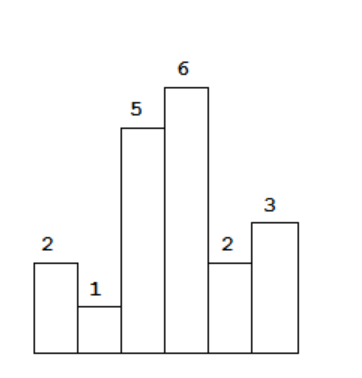
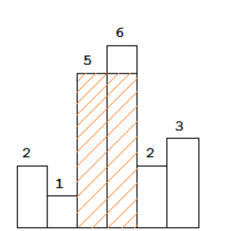
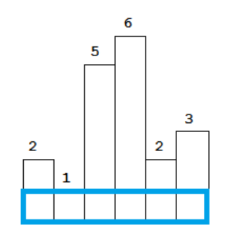
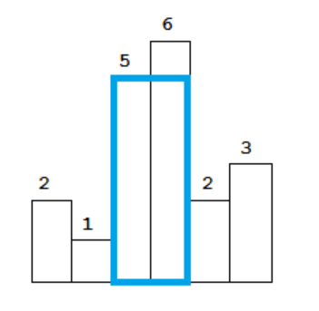
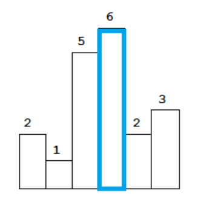
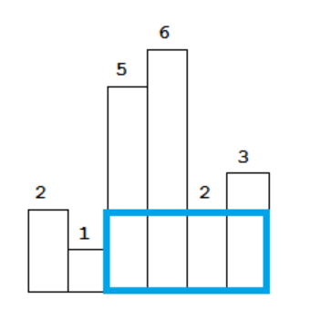
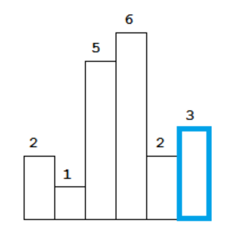

# [柱状图中最大的矩形](https://leetcode-cn.com/problems/largest-rectangle-in-histogram/)  

## 描述  
**困难**  
给定 n 个非负整数，用来表示柱状图中各个柱子的高度。每个柱子彼此相邻，且宽度为 1 。

求在该柱状图中，能够勾勒出来的矩形的最大面积。  
<div></div>

以上是柱状图的示例，其中每个柱子的宽度为 1，给定的高度为 [2,1,5,6,2,3]。

<div></div>

图中阴影部分为所能勾勒出的最大矩形面积，其面积为 10 个单位。

## 示例  

    输入: [2,1,5,6,2,3]
    输出: 10


## 解题  
首先如果有最大的面积，肯定有一个最短的柱子作为高  
例如上图5和6，5比较短，所以以5为高  
先将包含各个柱子的最大面积求出来，然后求出其中的最大值 
可以看[这一篇](https://blog.csdn.net/Zolewit/article/details/88863970)的解释与图  

- 能完全覆盖第0个柱子的最大矩形  
    <div></div>
- 能完全覆盖第1个柱子的最大矩形  
    <div></div>
- 能完全覆盖第2个柱子的最大矩形
    <div></div>
- 能完全覆盖第3个柱子的最大矩形
    <div></div>
- 能完全覆盖第4个柱子的最大矩形
    <div></div>
- 能完全覆盖第5个柱子的最大矩形
    <div></div>

然后只需比较各个矩形的大小  

这里首先想到的是双指针  
从当前的柱子向左向右扫描，碰到比当前柱子小的数则停下，计算宽，以当前柱子高为高，计算面积。    
得出不同柱子上的矩形面积，选择最大的   
注意代码中的right-left-1来计算宽   

可惜下面的代码超出时间限制了  
```python 
class Solution:
    def largestRectangleArea(self, heights: List[int]) -> int:
        max_area = 0
        n = len(heights)
        for i in range(n):
            left = i
            right = i
            while left>=0 and heights[left] >= heights[i]:
                left -= 1 
            while right < n and heights[right] >= heights[i]:
                right += 1
            
            max_area = max(max_area, heights[i]*(right-left-1))

        return max_area
```  


需要改进算法  
然后从博文等地方学习到了``单调栈``  
就是让栈内元素保持一定的单调性的栈  
例如  
- 2 入栈时，栈为空，直接入栈。栈内元素为2
- 1 入栈时，栈顶2比1大，栈顶元素2出栈，1入栈。栈内元素1
- 5 入栈时，栈顶1小于5，入栈。栈内元素1，5
- 6 入栈时，栈顶5小于6，入栈。栈内元素1，5，6
- 2 入栈时，栈顶6大于2，出栈，栈顶5大于2，出栈，然后2入栈。栈内元素1，2
- 3 入栈时，栈顶2小于3，入栈，栈内元素1，2，3  

如果将其下标入栈  
例如，[2,1,5,6,2,3]，下标索引为[0,1,2,3,4,5]  
- 2 索引0，入栈时，栈为空，直接将索引入栈。栈内元素为0
- 1 索引1，入栈时
    - 栈顶为0，heights[0]=2比1大，栈顶0出栈，相当于heights[0]=2的那根柱子的找到了right右边界
    - 出栈后，栈为空，所以宽为1
    - 计算出heights[0]=2柱子所覆盖的面积，1*2=2
    - 然后索引1入栈，栈内元素1
- 5 索引2，入栈时，栈顶元素1对应1小于5，将索引2入栈。栈内元素1，2
- 6 索引3，入栈时，栈顶元素2对应5小于6，将索引3入栈。栈内元素1，2，3
- 2 索引4，入栈时
    - 栈顶元素3对应6大于2，栈顶3出栈，相当于heights[3]=6的右边界为当前索引4
    - 出栈后栈顶为2，即height[3]=6的左边界为2（heights[2] < heights[3]），所以宽为4-2-1=1
    - 计算出heights[3]=6所覆盖的面积，1*6=6
    - 当前栈内元素1，2
    - 栈顶元素2对应5大于2，栈顶2出栈，相当于heights[2]=5的右边界为当前索引4
    - 出栈后栈顶为1，即height[2]=5的左边界为1（heights[1] < heights[2]），所以宽为4-1-1=2
    - 计算出heights[2]=5所覆盖的面积，2*5=10
    - 当前栈内元素1
    - 栈顶元素1对应1小于2，将索引4入栈。栈内元素1，4
- 3 索引5，入栈时，栈顶元素4对应2小于3，将索引5入栈，栈内元素1，4，5
- 元素已遍历完，当前栈内元素1，4，5。开始逐个弹出栈顶元素  
- 弹出栈顶元素5，对应高度为3，当前栈顶为4，则宽为6-4-1=1，6为最右边界，即柱子的个数，面积为1*3=3。
- 弹出栈顶元素4，对应高度为2，当前栈顶为1，则宽为6-1-1=4，面积4*2=8
- 弹出栈顶元素1，对应高度为1，栈为空，则宽就是6，面积为6*1=6 
  
6个柱子对应覆盖的面积都求完了（并不是按顺序的），然后取最大值

需要在代码中加个trick  
再添加一个柱子，高度为0，这样就可以弹出元素  
在初始栈中加-1，便于计算宽

```python
class Solution:
    def largestRectangleArea(self, heights: List[int]) -> int:
        max_area = 0
        heights.append(0)
        n = len(heights)
        stack = [-1]
        for i in range(n):
            while len(stack)>1 and heights[stack[-1]] > heights[i]:
                top = stack.pop()
                area = heights[top] * (i-stack[-1]-1)
                max_area = max(max_area, area)
            stack.append(i)

        return max_area

```
