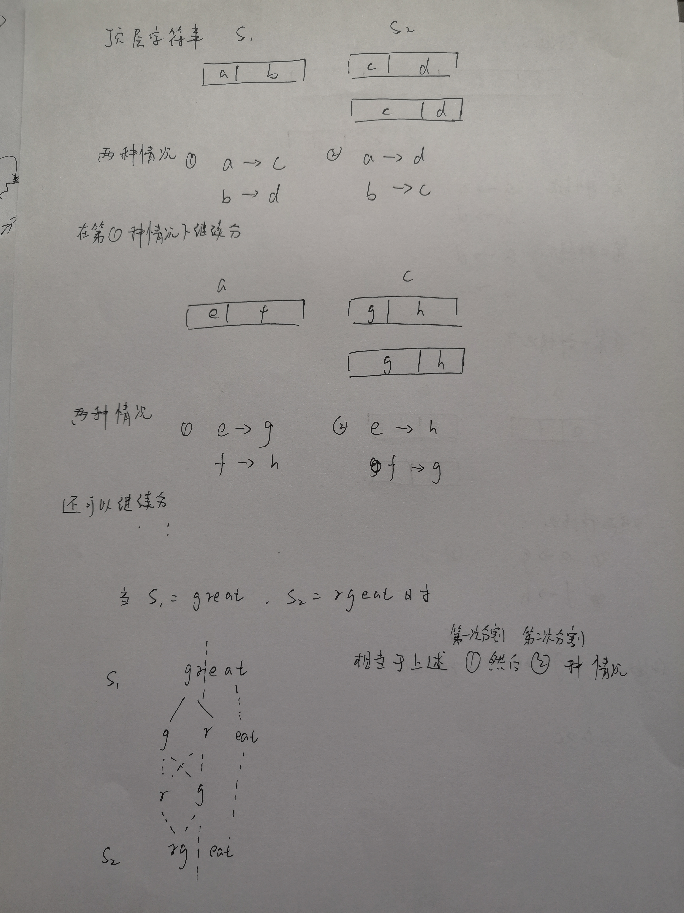

# [扰乱字符串](https://leetcode-cn.com/problems/scramble-string/)

## 描述  
**困难** 

给定一个字符串 s1，我们可以把它递归地分割成两个非空子字符串，从而将其表示为二叉树。

下图是字符串 s1 = "great" 的一种可能的表示形式。

        great
        /    \
        gr    eat
        / \    /  \
        g   r  e   at
                   / \
                  a   t

在扰乱这个字符串的过程中，我们可以挑选任何一个非叶节点，然后交换它的两个子节点。

例如，如果我们挑选非叶节点 "gr" ，交换它的两个子节点，将会产生扰乱字符串 "rgeat" 。

        rgeat
        /    \
        rg    eat
        / \    /  \
        r   g  e   at
                   / \
                  a   t

我们将 "rgeat” 称作 "great" 的一个扰乱字符串。

同样地，如果我们继续交换节点 "eat" 和 "at" 的子节点，将会产生另一个新的扰乱字符串 "rgtae" 。

        rgtae
       /    \
      rg    tae
    / \    /  \
    r   g  ta  e
          / \
         t   a

我们将 "rgtae” 称作 "great" 的一个扰乱字符串。

给出两个长度相等的字符串 s1 和 s2，判断 s2 是否是 s1 的扰乱字符串。

**示例 1:**

    输入: s1 = "great", s2 = "rgeat"
    输出: true
**示例 2:**

    输入: s1 = "abcde", s2 = "caebd"
    输出: false

## 解题   

判断扰乱的前期是 s1,s2的长度要相等   

然后将s1，s2分别分割成两部分进行判断，分割出的两部分都不为空  

该两部分的长度要对应

下图为一个例子  
<div></div>    

- 图上第一种情况相当于 `s1[:i] -> s2[:i] && s1[i:] -> s2[i:]`。s1中前i个字符变为了s2中前i个字符，同时，s1中剩余的字符可以变成s2中剩余的字符
- 图上第二种情况相当于 `s1[:i] -> s2[-i:] && s1[i:] -> s2[:-i]` 。s1中前i个字符变成了s2中后i个字符，同时，s1中剩余的字符可以变成s2中剩余的字符

将一个问题分割成了小问题  

只需判断最底层，即两个字符时能够变换，如，`gr`和`rg`能否变换

设置`dp[i][j][k]`的三维动态数组  

`dp[i][j][k]` 表示字符串s1中i开始的长度为k的子串能否变换成s2中j开始的长度为k的子串  

最后的目标为`d[0][0][len]`，表示从0开始的两个字符串是否成功能变换  

`dp[i][j][k]`可以根据图上的两种情况分为两种情况  

- `dp[i][j][w] && dp[i+w][j+w][k-w]` 表示图上第一种情况
- `dp[i][j+k-w] && dp[i+w][j][k-w]` 表示图上第二种情况

其中，w是在长度为k的子串中的切分位置，`1<=w<=k-1`  

在初始条件下，k=1，即不能再分割，当`s1[i]`与`s2[j]`相等时，`d[i][j][1]`取true，否则为false  

```python
class Solution:
    def isScramble(self, s1: str, s2: str) -> bool:
        len1 = len(s1)
        len2 = len(s2)
        # s1 s2 字符串长度需相同
        if len1 != len2:
            return False
        # 最里面的长度为len1+1，用不到dp[i][j][0]
        dp = [[[False for _ in range(len1+1)] for _ in range(len1)] for _ in range(len1)]

        # 初始化  
        for i in range(len1):
            for j in range(len1):
                if s1[i] == s2[j]:
                    dp[i][j][1] = True
        
        # 各区间长度，长度为1的单字符已经初始化了，长度最大为原始字符串的长度
        for k in range(2, len1+1):
            # i的初始位置为0，最后的位置肯定要与len1差k个
            # 不然从i到len1就不足k的长度了
            for i in range(len1-k+1):
                # j也一样 
                for j in range(len1-k+1):
                    # 长度为k的字符串再分割出子串，w为分割线
                    for w in range(1, k):
                        # 第一种情况
                        if dp[i][j][w] and dp[i+w][j+w][k-w]:
                            dp[i][j][k] = True
                            # 满足条件就直接break，表示可以变换，直接进行行下一循环
                            break
                        # 第二种情况
                        if dp[i][j+k-w][w] and dp[i+w][j][k-w]:
                            dp[i][j][k] = True
                            break
        
        return dp[0][0][len1]

```

当然也有递归  

```python
class Solution:
    def isScramble(self, s1: str, s2: str) -> bool:
        # 如果两个字串相同
        if s1 == s2:
            return True
        # 两个子串包含不同的字符
        if sorted(s1) != sorted(s2):
            return False
        for i in range(1, len(s1)):
            # 第一种情况
            if self.isScramble(s1[:i], s2[:i]) and self.isScramble(s1[i:], s2[i:]):
                return True
            # 第二种情况
            if self.isScramble(s1[:i], s2[-i:]) and self.isScramble(s1[i:], s2[:-i]):
                return True
        return False
```

