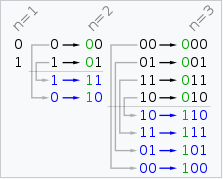

# [格雷编码](https://leetcode-cn.com/problems/gray-code/)


## 描述  
**中等**  

格雷编码是一个二进制数字系统，在该系统中，两个连续的数值仅有一个位数的差异。

给定一个代表编码总位数的非负整数 n，打印其格雷编码序列。格雷编码序列必须以 0 开头。

**示例 1:**

    输入: 2
    输出: [0,1,3,2]
    解释:
    00 - 0
    01 - 1
    11 - 3
    10 - 2
    
    对于给定的 n，其格雷编码序列并不唯一。
    例如，[0,2,3,1] 也是一个有效的格雷编码序列。
    
    00 - 0
    10 - 2
    11 - 3
    01 - 1

**示例 2:**


    输入: 0
    输出: [0]
    解释: 我们定义格雷编码序列必须以 0 开头。
         给定编码总位数为 n 的格雷编码序列，其长度为 2n。当 n = 0 时，长度为 20 = 1。
         因此，当 n = 0 时，其格雷编码序列为 [0]。

## 解题  
先了解了下格雷编码，[维基百科](https://zh.wikipedia.org/wiki/%E6%A0%BC%E9%9B%B7%E7%A0%81)

**直接排列**  

以二进制为0值的格雷码为第零项，第一项改变最右边的位元，第二项改变右起第一个为1的位元的左边位元，第三、四项方法同第一、二项，如此反复，即可排列出n个位元的格雷码

```python
class Solution:
    def grayCode(self, n: int) -> List[int]:
        res = [0]
        for i in range(1, 2**(n)):
            pre = res[-1]
            # 第一项，改变最后边的单元
            if i % 2 == 1:
                pre ^= 1  # 异或，取反
                res.append(pre)
            # 第二项，改变右起第一个为1的位元的左边位元
            else:
                temp = pre
                for j in range(n):
                    if temp & 1 == 1:
                        pre = pre ^ (1 << (j + 1))
                        res.append(pre)
                        break
                    temp >>= 1
        return res

```

**镜射排列**  

n位元的格雷码可以从n-1位元的格雷码以上下镜射后加上新位元的方式快速的得到，如下图所示一般。

<div></div>

```python
class Solution:
    def grayCode(self, n: int) -> List[int]:
        res = [0]
        head = 1
        for i in range(n):
            # 将res中的二进制数前加1，上图中的蓝色部分
            for j in range(len(res)-1, -1, -1):
                res.append(head+res[j])
            head <<= 1
        return res

```