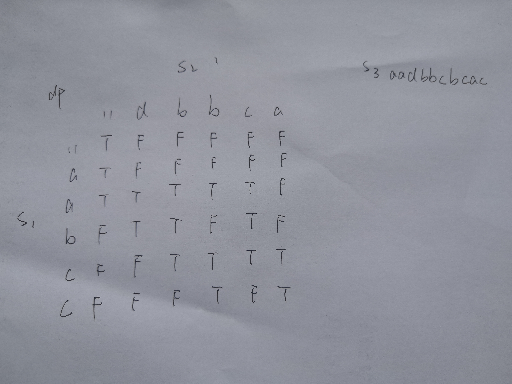

# [交错字符串](https://leetcode-cn.com/problems/interleaving-string/)

## 描述  
**困难**  

给定三个字符串 s1, s2, s3, 验证 s3 是否是由 s1 和 s2 交错组成的。

**示例 1:**

    输入: s1 = "aabcc", s2 = "dbbca", s3 = "aadbbcbcac"
    输出: true
**示例 2:**

    输入: s1 = "aabcc", s2 = "dbbca", s3 = "aadbbbaccc"
    输出: false
## 解题  

动态规划  

使用`dp[i][j]`表示s1的前i个字符和s2的前j个字符能否构成s3的前i+j个字符  

当s1长度+s2长度!=s3长度时，显然不能构成，返回False  

<div></div>

**初始化**  

- `dp[0][0] = True`
- 初始化第一列，`dp[i][0]`表示s1的前i个字符能否构成s3的前i个字符，第i个字符下标为i-1  
    - 只要`s1[i-1] = s3[i-1]`，则`dp[i][0] = True`
- 初始化第一行，`dp[0][j]`表示s2的前j个字符能否构成s3的前j个字符，第j个字符下标为j-1  
    - 只要`s2[j-1] = s3[i-1]`，则`dp[0][j] = True`

**状态转移方程**  

当s1的前i个字符和s2的前j个字符能构成s3的前i+j个字符时有两种情况  

- s1的前i个字符和s2的前j-1个字符能构成s3前i+j-1个字符，且s2的第j个字符等于s3第i+j个字符  
    - `dp[i][j] = dp[i][j-1] and (s2[j-1]==s3[i+j-1])`
- s1的前i-1个字符和s2的前j个字符能构成s3前i+j-1个字符，且s1的第i个字符等于s3第i+j个字符  
    - `dp[i][j] = dp[i-1][j] and (s1[i-1]==s3[i+j-1])`
- 综合起来  
    - `dp[i][j] = (dp[i][j-1] and (s2[j-1]==s3[i+j-1])) or (dp[i-1][j] and (s1[i-1]==s3[i+j-1]))` 

最后返回`dp[len1][len2]`，判断s1,s2是否能构成s3

```python
class Solution:
    def isInterleave(self, s1: str, s2: str, s3: str) -> bool:
        len1 = len(s1)
        len2 = len(s2)
        len3 = len(s3)
        if (len1+len2) != len3:
            return False
        dp = [[False for i in range(len2+1)] for j in range(len1+1)]
        dp[0][0] = True

        for i in range(1, len1+1):
            if s1[i-1] == s3[i-1]:
                dp[i][0] = True
            else:
                break
        for j in range(1, len2+1):
            if s2[j-1] == s3[j-1]:
                dp[0][j] = True
            else:
                break
        
        for i in range(1, len1+1):
            for j in range(1, len2+1):
                dp[i][j] = (dp[i][j-1] and (s2[j-1]==s3[i+j-1])) or (dp[i-1][j] and (s1[i-1]==s3[i+j-1])) 

        return dp[len1][len2]
```

