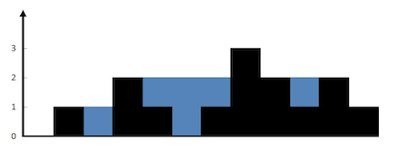

# [接雨水](https://leetcode-cn.com/problems/trapping-rain-water/)

## 描述  
**困难**  

给定 n 个非负整数表示每个宽度为 1 的柱子的高度图，计算按此排列的柱子，下雨之后能接多少雨水。

<div align="left"></div>

上面是由数组 [0,1,0,2,1,0,1,3,2,1,2,1] 表示的高度图，在这种情况下，可以接 6 个单位的雨水（蓝色部分表示雨水）。

**示例**

    输入: [0,1,0,2,1,0,1,3,2,1,2,1]
    输出: 6

## 解题  

最简单的一种思路，找到最高的那根柱子  

从左边开始扫描，如果下一根比之前高，那么就更新柱子，否则就可以接雨水  

不过思路简单的代码，击败了7.25%的用户。。。

```python
class Solution:
    def trap(self, height: List[int]) -> int:
        if len(height) < 2:
            return 0
        max_height = 0
        max_height_index = 0
        for i in range(len(height)):
            if height[i] > max_height:
                max_height = height[i]
                max_height_index = i

        area = 0
        temp = height[0]
        for i in range(max_height_index):
            if height[i] > temp:  
                # 更新柱子
                temp = height[i]
            else:
                # 接雨水
                area += temp - height[i]

        temp = height[-1]
        for i in range(len(height)-1, max_height_index, -1):
            if height[i] > temp:
                temp = height[i]
            else:
                area += temp - height[i]

        return area
```

**双指针**   

`maxleft`是`height[0:left]`中最高的柱子高度  

`maxright`是`height[right:]`中最高的柱子高度  

一根柱子上的储水量 = min(左边最高，右边最高) - 这根柱子的高度  

然后用双指针扫描同时计算高度   

```python
class Solution:
    def trap(self, height: List[int]) -> int:
        if len(height) < 2:
            return 0
        n = len(height)
        
        left, right = 0, n-1
        maxleft, maxright = height[0], height[n-1]
        ans = 0
        while left <= right:
            maxleft = max(height[left], maxleft)
            maxright = max(height[right], maxright)
            if maxleft < maxright:
                ans += maxleft - height[left]
                left += 1
            else:
                ans += maxright - height[right]
                right -= 1
        return ans
```

