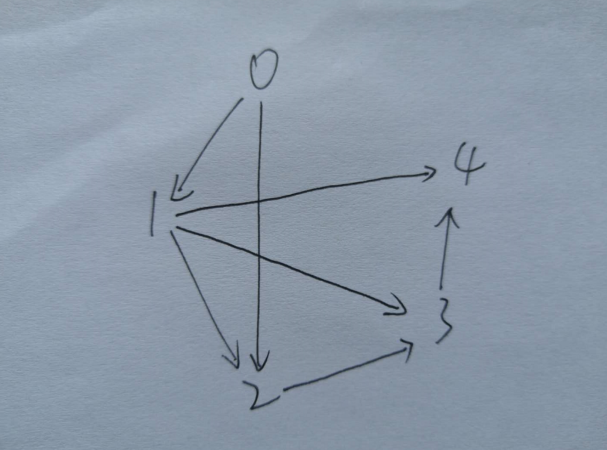

# [跳跃游戏II](https://leetcode-cn.com/problems/jump-game-ii/)

## 描述  
**困难**  

给定一个非负整数数组，你最初位于数组的第一个位置。

数组中的每个元素代表你在该位置可以跳跃的最大长度。

你的目标是使用最少的跳跃次数到达数组的最后一个位置。

**示例**

    输入: [2,3,1,1,4]
    输出: 2
    解释: 跳到最后一个位置的最小跳跃数是 2。
         从下标为 0 跳到下标为 1 的位置，跳 1 步，然后跳 3 步到达数组的最后一个位置。
    
    说明:
    假设你总是可以到达数组的最后一个位置。

## 解题  
这种题目，当然是用动态规划了   

不过超时了

```python 
class Solution:
    def jump(self, nums: List[int]) -> int:
        length = len(nums)
        dp = [0 for _ in range(length)]
        for i in range(1, length):
            dp[i] = i
            for j in range(i+1):
                if j+nums[j] >= i: 
                    dp[i] = dp[j] + 1
                    break
        
        return dp[length-1]
```

可以将节点当作图，例如`[2,3,1,1,4]`
<div align="left"></div>

下标为i当作第i个节点，`nums[i]=2`，相当于出度为2，并且指向比它大的2个最近的节点  

广度优先遍历，可以确定是第几层遍历到   

`nums[i]+i`表示该层的最后一个位置  

比如第一层到1，2  

第二层到3，4

也类似贪心算法，每次跳到最远

```python
class Solution:
    def jump(self, nums: List[int]) -> int:
        start, end = 0, 0
        steps = 0
        while end < len(nums) - 1:
            last = end
            for i in range(start, end + 1):
                last = max(last, nums[i] + i) # 当前能跳到最远的地方
                
            start = end + 1
            end = last
            steps += 1

        return steps
```