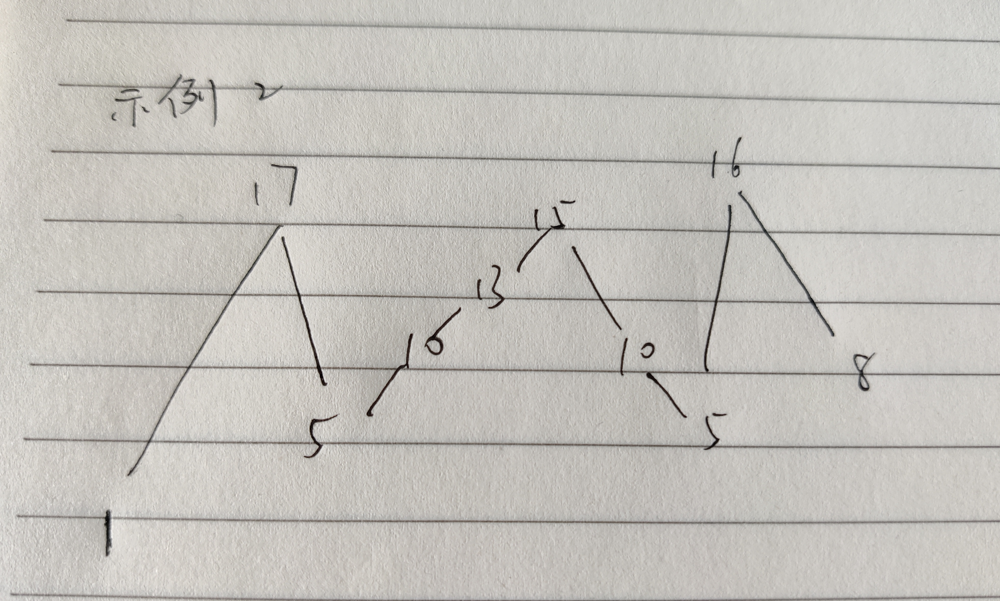
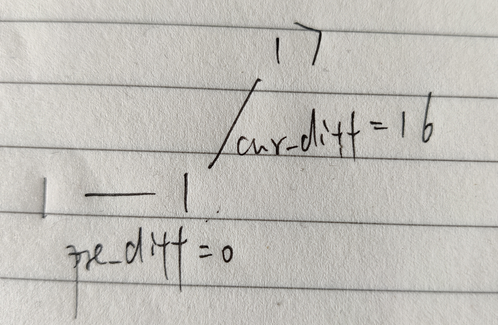

# [摆动序列](https://leetcode-cn.com/problems/wiggle-subsequence/)

## 描述

**中等**

如果连续数字之间的差严格地在正数和负数之间交替，则数字序列称为摆动序列。第一个差（如果存在的话）可能是正数或负数。少于两个元素的序列也是摆动序列。

例如， `[1,7,4,9,2,5]` 是一个摆动序列，因为差值 `(6,-3,5,-7,3)` 是正负交替出现的。相反, `[1,4,7,2,5]` 和 `[1,7,4,5,5]` 不是摆动序列，第一个序列是因为它的前两个差值都是正数，第二个序列是因为它的最后一个差值为零。

给定一个整数序列，返回作为摆动序列的最长子序列的长度。 通过从原始序列中删除一些（也可以不删除）元素来获得子序列，剩下的元素保持其原始顺序。

**示例 1:**

```
输入: [1,7,4,9,2,5]
输出: 6 
解释: 整个序列均为摆动序列。
```

**示例 2:**

```
输入: [1,17,5,10,13,15,10,5,16,8]
输出: 7
解释: 这个序列包含几个长度为 7 摆动序列，其中一个可为[1,17,10,13,10,16,8]。
```

**示例 3:**

```
输入: [1,2,3,4,5,6,7,8,9]
输出: 2
```

**进阶:**
你能否用 O(n) 时间复杂度完成此题?

## 解题

拿示例2举例，原序列为`[1,17,5,10,13,15,10,5,16,8]`，按照大小顺序简单画下图

如果是要找摆动序列的最长的子序列长度，那么就是**峰**和**谷**的数量

如下图，由**峰**和**谷**组成的序列为`[1,17,5,15,5,16,8]`，序列长度为7，为最长摆动子序列

如果不是由峰和谷组成的子序列，其可能不是最长摆动子序列

<div align="left"> </div>

那么问题就简单了，只需要统计峰和谷的数量就行了

使用`cur_diff`记录当前数字和前一个数字的差

使用`pre_diff`记录前一个`cur_diff`

当`cur_diff`和`pre_diff`异号时，说明找到了一个**峰**或**谷**

当然，可能会出现相邻数字相等的情况

代码中使用一个**大于号**一个**小于等于**来判断**谷**，一个**小于号**一个**大于等于**来判断**峰**

若当前数字为`17`，`cur_diff`为`16`，`pre_diff`为`0`，说明是一个目标值

此时摆动序列长度为`2`，所以设置初始`res`为`1`

<div align="left"> </div>

```python
class Solution:
    def wiggleMaxLength(self, nums: List[int]) -> int:
        n = len(nums)
        if n <= 1:
            return n
        
        cur_diff = 0
        pre_diff = 0
        res = 1 
        for i in range(1, n):
            cur_diff = nums[i] - nums[i-1]
            if (cur_diff > 0 and pre_diff <= 0) or (cur_diff < 0 and pre_diff >= 0):
                res += 1
                pre_diff = cur_diff
            
        return res
```


