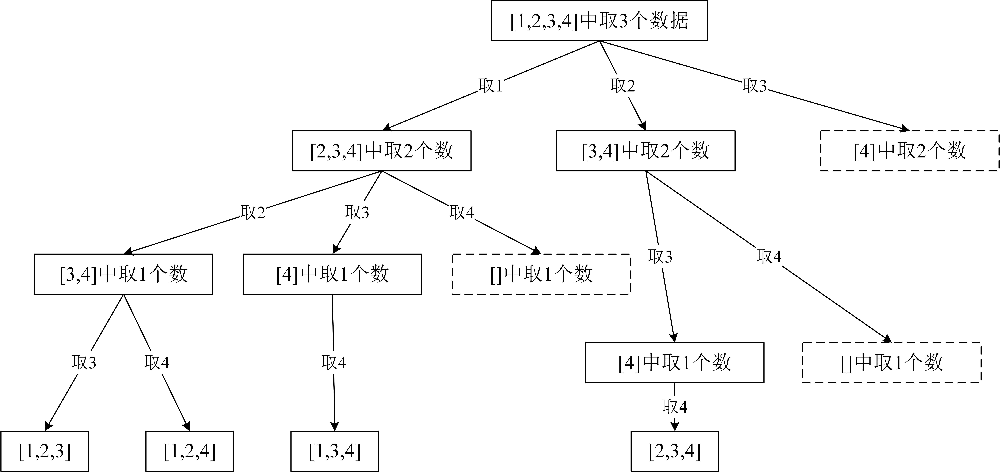

# [组合](https://leetcode-cn.com/problems/combinations/)

## 描述  
**中等** 
给定两个整数 n 和 k，返回 1 ... n 中所有可能的 k 个数的组合。

**示例**

    输入: n = 4, k = 2
    输出:
    [
        [2,4],
        [3,4],
        [2,3],
        [1,2],
        [1,3],
        [1,4],
    ]

## 解题  

回溯（深度优先遍历）

每次判断还需要几个数（`k`）才能组成一个解

当`k`为`0`时，说明此时组成了一个解

`dfs`函数中的`i`表示每个解中添加的数的范围

一开始写的时候，`res`直接`append`的`temp`，没有`[:]`，最后的结果为空

后来发现，`temp`一直在变化，到最后`temp`为空，所以`res`的每个解都为空 

```python
# python
class Solution:
    def combine(self, n: int, k: int) -> List[List[int]]:
        res = []
		
        def dfs(k, temp, i):
            if k == 0:
                res.append(temp[:])
                return 
            
            for j in range(i, n+1):
                temp.append(j)
                dfs(k-1, temp, j+1)
                temp.pop()

        dfs(k, [], 1)
        return res

```

```java
// Java
class Solution {
    private List<List<Integer>> res = new ArrayList<>();
    private List<Integer> temp = new ArrayList<>();
    private int n;

    public List<List<Integer>> combine(int n, int k) {
        this.n = n;
        dfs(k, temp, 1);
        return res;

    }

    private void dfs(int k, List<Integer> temp, int i) {
        if (k == 0) {
            res.add(new ArrayList<>(temp));
            return;
        }
        for (int j = i; j < n + 1; j++) {
            temp.add(j);
            dfs(k-1, temp, j+1);
            temp.remove(temp.size() - 1);
        }
    }
}
```

然后发现，时间上还是挺慢的，需要对`dfs`进行剪枝

例如在`n=4`， `k=3`时，如果从`3`开始搜索，得到`3`，`4`，此时已不足3个数

因此，**搜索的起始点存在上限**

<div>

如上图，虚线框部分可以提前剪枝

只需判断剩下的数组中是否具有足量的数据

反映在代码中，就是在dfs函数的for循环中，设置合理的起始点上限

其效率也就上来了

<div></div>

```python
# python
class Solution:
    def combine(self, n: int, k: int) -> List[List[int]]:
        res = []
		
        def dfs(k, temp, i):
            if k == 0:
                res.append(temp[:])
                return 
            # 设置起始点上限，剪枝
            for j in range(i, n-k+2):
                temp.append(j)
                dfs(k-1, temp, j+1)
                temp.pop()

        dfs(k, [], 1)
        return res
```

<div></div>

```java
// Java
class Solution {
    private List<List<Integer>> res = new ArrayList<>();
    private List<Integer> temp = new ArrayList<>();
    private int n;

    public List<List<Integer>> combine(int n, int k) {
        this.n = n;
        dfs(k, temp, 1);
        return res;

    }

    private void dfs(int k, List<Integer> temp, int i) {
        if (k == 0) {
            res.add(new ArrayList<>(temp));
            return;
        }
        // 设置起始点上限，剪枝
        for (int j = i; j < n - k + 2; j++) {
            temp.add(j);
            dfs(k-1, temp, j+1);
            temp.remove(temp.size() - 1);
        }
    }
}
```

