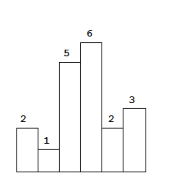
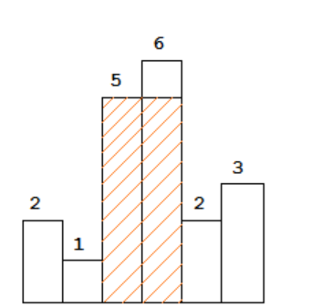
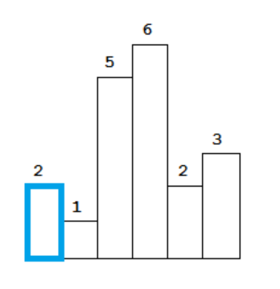
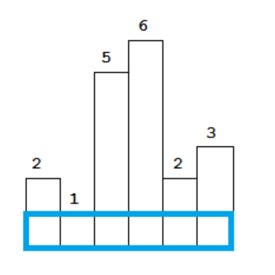
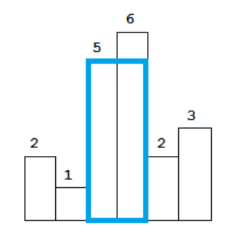
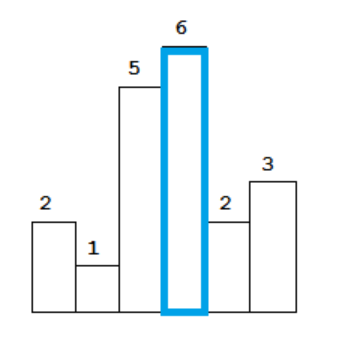
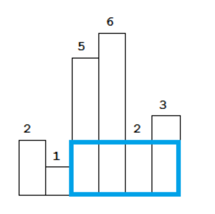
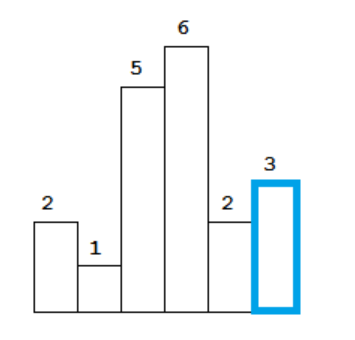

# [84_柱状图中最大的矩形](https://leetcode-cn.com/problems/largest-rectangle-in-histogram/)  

## 描述  
**困难**  

给定 n 个非负整数，用来表示柱状图中各个柱子的高度。每个柱子彼此相邻，且宽度为 1 。

求在该柱状图中，能够勾勒出来的矩形的最大面积。  
<div></div>

以上是柱状图的示例，其中每个柱子的宽度为 1，给定的高度为 [2,1,5,6,2,3]。

<div></div>

图中阴影部分为所能勾勒出的最大矩形面积，其面积为 10 个单位。

**示例**  

    输入: [2,1,5,6,2,3]
    输出: 10


## 解题  
首先如果有最大的面积，肯定有一个最短的柱子作为高  

例如上图中的柱子，5和6，其中5比较短，所以以5为高  

先将包含各个柱子的最大面积求出来，然后求出其中的最大值 

- 能完全覆盖第0个柱子的最大矩形  
  
    <div></div>
- 能完全覆盖第1个柱子的最大矩形  
  
    <div></div>
- 能完全覆盖第2个柱子的最大矩形
  
    <div></div>
- 能完全覆盖第3个柱子的最大矩形
  
    <div></div>
- 能完全覆盖第4个柱子的最大矩形
  
    <div></div>
- 能完全覆盖第5个柱子的最大矩形
  
    <div></div>

然后只需比较各个矩形的大小  

这里首先想到的是双指针  

从当前的柱子向左向右扫描扩展，碰到比当前柱子小的数则停下，计算宽，以当前柱子高为高，计算面积。

得出不同柱子上的矩形面积，选择最大的   

注意代码中的`right-left-1`来计算宽   

可惜下面的代码超出时间限制了  
```python 
class Solution:
    def largestRectangleArea(self, heights: List[int]) -> int:
        max_area = 0
        n = len(heights)
        for i in range(n):
            left = i
            right = i
            while left >= 0 and heights[left] >= heights[i]:
                left -= 1 
            while right < n and heights[right] >= heights[i]:
                right += 1
            
            max_area = max(max_area, heights[i] * (right-left-1))

        return max_area
```

需要改进算法  

然后从博文等地方学习到了**单调栈**  

就是让栈内元素保持一定的单调性的栈  

例如 ，`[2,1,5,6,2,3]` ，保持栈内递增

- `2` 入栈时，栈为空，直接入栈。栈内元素为`[2]`
- `1` 入栈时，栈顶`2`比`1`大，栈顶元素`2`出栈，1入栈。栈内元素`[1]`
- `5` 入栈时，栈顶`1`小于`5`，入栈。栈内元素`[1, 5]`
- `6` 入栈时，栈顶`5`小于`6`，入栈。栈内元素`[1，5，6]`
- `2` 入栈时，栈顶`6`大于`2`，出栈，栈顶5大于2，出栈，然后2入栈。栈内元素`[1，2]`
- `3` 入栈时，栈顶`2`小于`3`，入栈，栈内元素`[1，2，3]`  

如果将其**下标索引**入栈  

例如，`[2,1,5,6,2,3]`，下标索引为`[0,1,2,3,4,5]`  

用`s[i]`表示覆盖第`i`个矩形的最大矩形面积

- `2` 的索引`0`，入栈时，栈为空，直接将索引入栈。栈内元素为`[0]`
- `1`的 索引`1`，入栈时
    - 栈顶为`0`，`heights[0]=2`比`1`大，栈顶`0`出栈，相当于`heights[0]=2`的那根柱子的找到了right右边界
    - 出栈后，栈为空，所以宽为`1`
    - 计算出`heights[0]=2`柱子所覆盖的面积，`s[0]=1*2=2`
    - 然后索引`1`入栈，栈内元素`[1]`
- `5` 的索引`2`，入栈时，栈顶的索引`1`对应数据`1`小于`5`，将索引`2`入栈。栈内元素`[1，2]`
- `6` 的索引`3`，入栈时，栈顶的索引`2`对应数据`5`小于`6`，将索引`3`入栈。栈内元素`[1，2，3]`
- 2 的索引`4`，入栈时
    - 栈顶元素`3`对应6大于`2`，栈顶`3`出栈，相当于`heights[3]=6`的右边界为当前索引`4`
    - 出栈后栈顶为`2`，即`height[3]=6`的左边界为`2`（`heights[2] < heights[3]`），所以宽为`4-2-1=1`
      - `4`是当前索引，`2`是当前栈顶的元素，`1`是需要减去的偏移
    - 计算出`heights[3]=6`所覆盖的面积，`s[3]=1*6=6`
    - 当前栈内元素`[1，2]`
    - 栈顶元素`2`对应`5`大于`2`，栈顶`2`出栈，相当于`heights[2]=5`的右边界为当前索引`4`
    - 出栈后栈顶为`1`，即`height[2]=5`的左边界为`1`（`heights[1] < heights[2]`），所以宽为`4-1-1=2`
    - 计算出`heights[2]=5`所覆盖的面积，`s[2]=2*5=10`
    - 当前栈内元素`[1]`
    - 栈顶元素`1`对应`1`小于`2`，将索引`4`入栈。栈内元素`[1，4]`
- `3` 的索引`5`，入栈时，栈顶元素`4`对应`2`小于`3`，将索引`5`入栈，栈内元素`[1，4，5]`
- 元素已遍历完，当前栈内元素`[1，4，5]`。开始逐个弹出栈顶元素  
- 弹出栈顶元素`5`，对应高度为`3`，当前栈顶为`4`，则宽为`6-4-1=1`，`6`为**最右边界**，即柱子的个数，面积为`s[5]=1*3=3`
- 弹出栈顶元素`4`，对应高度为`2`，当前栈顶为`1`，则宽为`6-1-1=4`，面积`s[4]=4*2=8`
- 弹出栈顶元素`1`，对应高度为`1`，栈为空，则宽就是`6`，面积为`s[1]=6*1=6` 
  

6个柱子对应覆盖的面积都求完了（并不是按顺序的），然后取最大值

需要在代码中加个**trick**  

再添加一个柱子，高度为**0**，这样就可以弹出剩下的元素  

在初始栈中加 **-1**，便于计算宽

```python
class Solution:
    def largestRectangleArea(self, heights: List[int]) -> int:
        max_area = 0
        heights.append(0)
        n = len(heights)
        stack = [-1]
        for i in range(n):
            while len(stack) > 1 and heights[stack[-1]] > heights[i]:
                top = stack.pop()
                max_area = max(max_area, heights[top] * (i - stack[-1] - 1))
            stack.append(i)

        return max_area

```

# [85_最大矩形](https://leetcode-cn.com/problems/maximal-rectangle/)

## 描述  

**困难**  

给定一个仅包含 0 和 1 的二维二进制矩阵，找出只包含 1 的最大矩形，并返回其面积。

**示例**

    输入:
    [
        ["1","0","1","0","0"],
        ["1","0","1","1","1"],
        ["1","1","1","1","1"],
        ["1","0","0","1","0"]
    ]
    输出: 6

## 解题  

首先将每列的数据转化一下  

例如第一列`[1,1,1,1]`可以转为`[1,2,3,4]` 

第三列`[1,1,1,0]`转为为`[1,2,3,0]`

其数字表示为该列上从上到下有多少个**连续**的1   

然后可以将上面的例子转化为  

    [
    	[1,0,1,0,0],
    	[2,0,2,1,1],
    	[3,1,3,2,2],
    	[4,0,0,3,0]
    ]

然后就可以按照第84题，将每一行当作一组数  

找出每一组的最大矩形，然后再取最大  

部分代码直接从第84题复制过来

```python
class Solution:
    def maximalRectangle(self, matrix: List[List[str]]) -> int:
        def largestRectangleArea(heights):
            max_area = 0
            heights.append(0)
            n = len(heights)
            stack = [-1]
            for i in range(n):
                while len(stack) > 1 and heights[stack[-1]] > heights[i]:
                    top = stack.pop()
                    max_area = max(max_area, heights[top] * (i - stack[-1] - 1))
                stack.append(i)

            return max_area

        if len(matrix) == 0 or len(matrix[0]) == 0:
            return 0
        m = len(matrix)	# 行数
        n = len(matrix[0])	# 列数

        max_area = 0
        dp = [0 for i in range(n)]
        for i in range(m):
            for j in range(n):
                dp[j] = dp[j] + 1 if matrix[i][j] == '1' else 0
            max_area = max(max_area, largestRectangleArea(dp))

        return max_area
```


