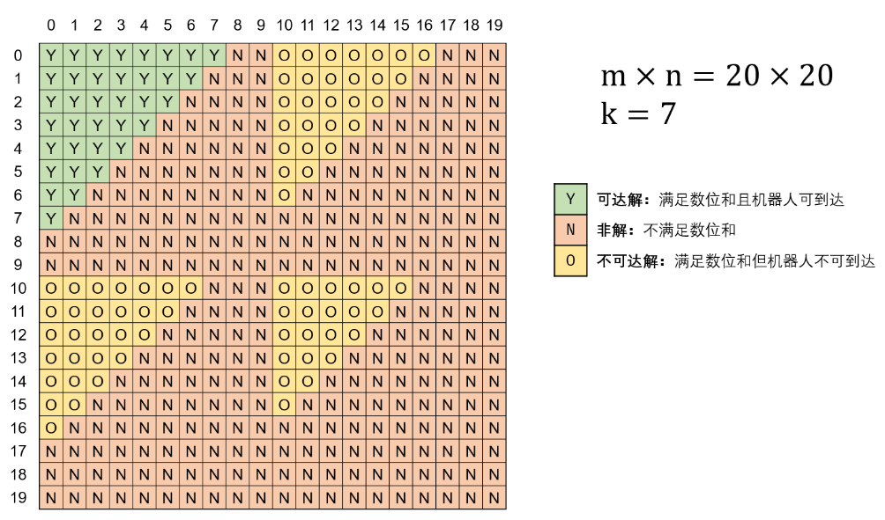

# [机器人的运动范围](https://leetcode-cn.com/problems/ji-qi-ren-de-yun-dong-fan-wei-lcof/)
## 描述  
**中等**  

地上有一个m行n列的方格，从坐标 [0,0] 到坐标 [m-1,n-1] 。一个机器人从坐标 [0, 0] 的格子开始移动，它每次可以向左、右、上、下移动一格（不能移动到方格外），也不能进入行坐标和列坐标的数位之和大于k的格子。例如，当k为18时，机器人能够进入方格 [35, 37] ，因为3+5+3+7=18。但它不能进入方格 [35, 38]，因为3+5+3+8=19。请问该机器人能够到达多少个格子？

**示例 1：**

    输入：m = 2, n = 3, k = 1
    输出：3
**示例 2：**

    输入：m = 3, n = 1, k = 0
    输出：1
**提示：**

    1 <= n,m <= 100
    0 <= k <= 20

## 解题  

设坐标位x和y  

由于  

    1 <= n,m <= 100

所以坐标数位之和为

    x // 10 + x % 10 + y // 10 + y % 10

机器人从（0，0）开始出发，每次向下或向右走，进行BFS  

```python
class Solution:
    def movingCount(self, m: int, n: int, k: int) -> int:
        visited = set() # 用于判断是否已经经过该坐标
        queue = [(0, 0)]
        while queue:
            x, y = queue.pop(0)
            # 判断坐标是否有效
            if x >= n or y >= m or (x // 10 + x % 10 + y // 10 + y % 10) > k or (x, y) in visited:
                continue
            visited.add((x, y))
            queue.append((x+1, y))
            queue.append((x, y+1))
        
        return len(visited)

```

DFS

```python
class Solution:
    def movingCount(self, m: int, n: int, k: int) -> int:
        visited = set()

        def dfs(x, y):
            if x >= n or y >= m or (x // 10 + x % 10 + y // 10 + y % 10) > k or (x, y) in visited:
                return 0
            visited.add((x, y))
            # 直接返回有效的坐标数量
            return 1 + dfs(x+1, y) + dfs(x, y+1)
        
        return dfs(0, 0)
```
当然，并不是所有的符合条件的坐标都能被计算到    

有些地方虽然满足数位和条件，但是没有路径可以到达  

<div></div>

图来源于[这](https://leetcode-cn.com/problems/ji-qi-ren-de-yun-dong-fan-wei-lcof/solution/mian-shi-ti-13-ji-qi-ren-de-yun-dong-fan-wei-dfs-b/)

